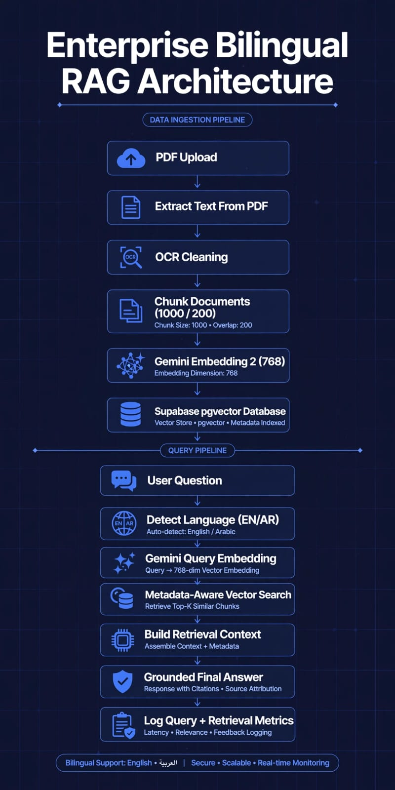
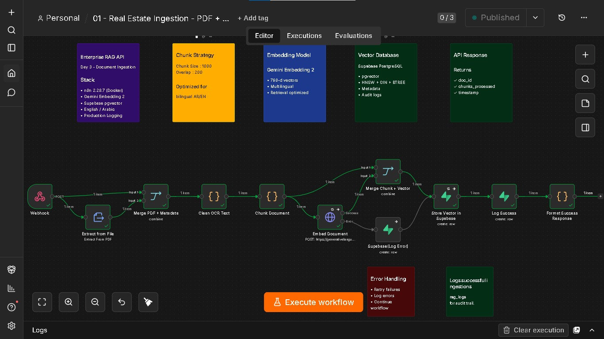
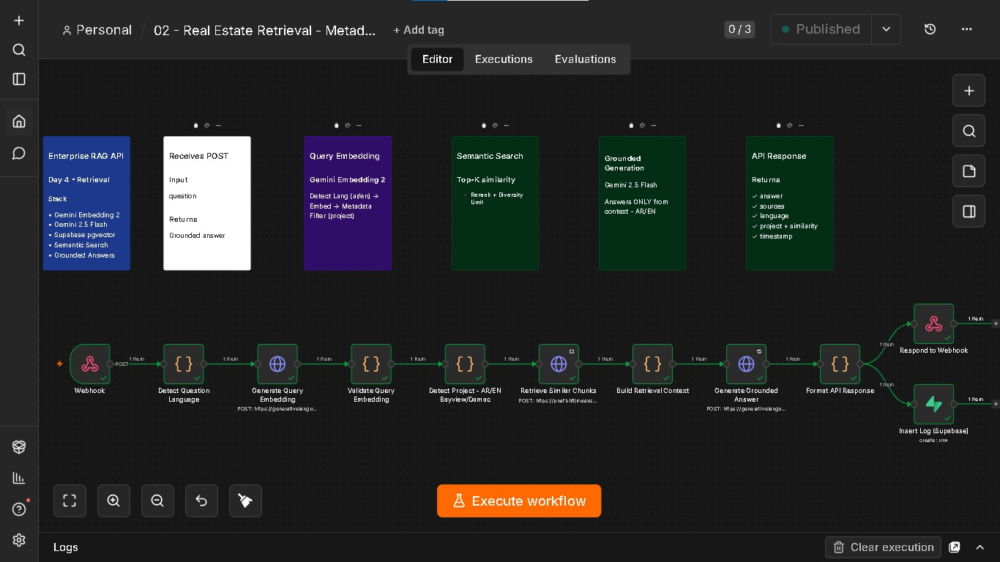
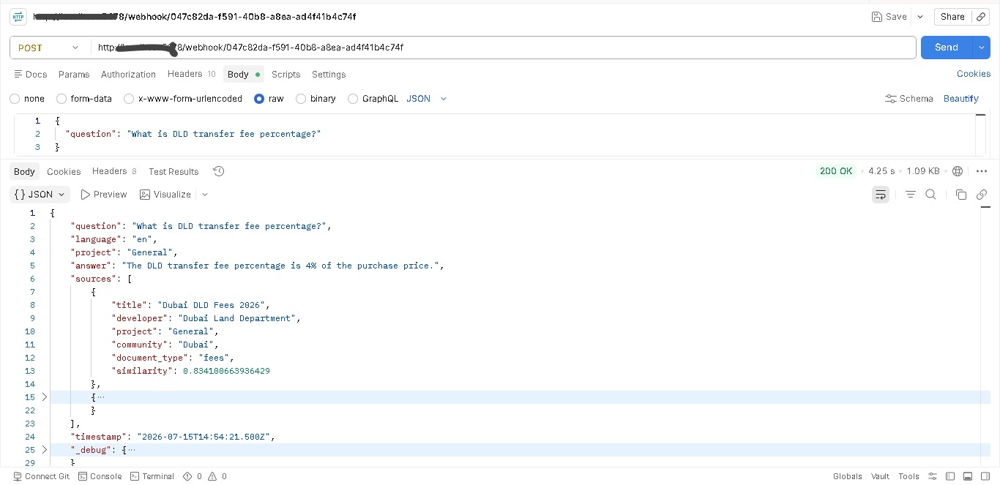
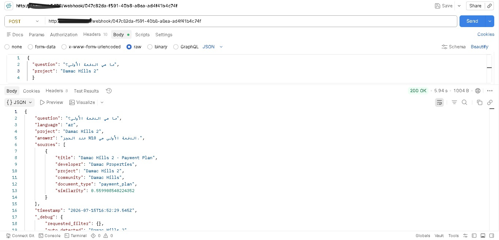
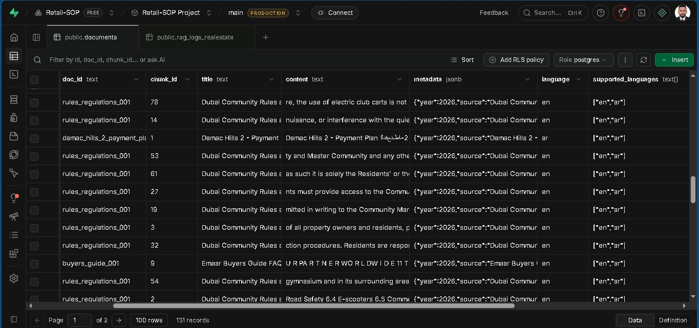
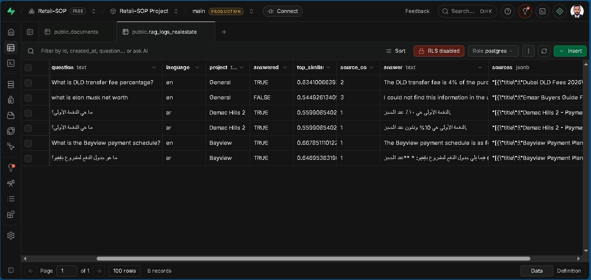

# 🏙️ Enterprise Dubai Real Estate RAG API (Bilingual)


A production-ready **Retrieval-Augmented Generation (RAG)** API built with **n8n**, **Supabase pgvector**, and **Google Gemini**. The system answers Dubai real estate questions using uploaded documents such as payment plans, community brochures, rules & regulations, FAQs, DLD guides, and legal documents in both **English** and **Arabic**.

---

# 🚀 Features

- 📄 PDF document ingestion
- 🔍 OCR text extraction & cleaning
- ✂️ Intelligent chunking with overlap
- 🧠 Gemini Embedding 2 (768 dimensions)
- 🗄️ Supabase pgvector semantic search
- 🏢 Metadata-aware retrieval
- 🌍 English & Arabic support
- 🤖 Grounded AI responses (Hallucination Protection)
- 📊 Enterprise RAG logging
- ⚡ REST API via n8n Webhooks

---


# 🏗 Architecture

```mermaid
flowchart TD
    A[PDF Upload] --> B[Extract Text From PDF] --> C[OCR Cleaning] --> D[Chunk Documents<br/>1000 / 200] --> E[Gemini Embedding 2<br/>768] --> F[(Supabase pgvector Database)]
    F --- G[User Question]
    G --> H[Detect Language<br/>EN / AR] --> I[Gemini Query Embedding] --> J[Metadata-Aware Vector Search] --> K[Build Retrieval Context] --> L[Gemini 2.5 Flash] --> M[Grounded Final Answer] --> N[Log Query + Retrieval Metrics]

    style F fill:#1a1a2e,stroke:#3b82f6,stroke-width:2px
    style J fill:#1e3a5f,stroke:#3b82f6,stroke-width:2px
```

<p align="center">
  


<details>
<summary>📄 View Mermaid Source</summary>


</p>

---

# 📸 Screenshots

## Document Ingestion Pipeline



---

## Retrieval Pipeline



---

## API Testing (Postman)

### English Query



### Arabic Query



---

## Supabase Vector Database

### Documents Table



### RAG Logs



---

# 🛠️ Tech Stack

| Technology | Purpose |
|------------|---------|
| n8n | Workflow Automation |
| Supabase | PostgreSQL Database |
| pgvector | Vector Search |
| Google Gemini 2.5 Flash | Answer Generation |
| Gemini Embedding 2 | Embedding Model |
| Docker | Self-hosted n8n |
| JavaScript | Workflow Logic |
| Postman | API Testing |

---

# 📂 Supported Document Types

- Payment Plans
- Community Brochures
- Project Brochures
- Rules & Regulations
- Buyer's Guide / FAQ
- DLD Fee Guides
- Arabic Property Documents

---

# 📑 Metadata Stored

Each chunk stores metadata used during retrieval.

```json
{
  "developer": "Emaar",
  "project": "Bayview",
  "community": "Dubai Harbour",
  "document_type": "Payment Plan",
  "language": "en",
  "year": 2026
}
```

---

# 📥 Ingestion Pipeline

```text
Webhook
    │
    ▼
Extract PDF
    │
    ▼
Clean OCR
    │
    ▼
Chunk Document
    │
    ▼
Gemini Embedding
    │
    ▼
Store Vector
    │
    ▼
Supabase
```

---

# 🔍 Retrieval Pipeline

```text
Webhook
    │
    ▼
Detect Language
    │
    ▼
Generate Query Embedding
    │
    ▼
Metadata-Aware Vector Search
    │
    ▼
Remove Duplicate Results
    │
    ▼
Build Retrieval Context
    │
    ▼
Gemini 2.5 Flash
    │
    ▼
Grounded Answer
    │
    ▼
Log Query
```

---

# 🌍 Bilingual Support

### English

**Question**

```
What is the Bayview payment schedule?
```

**Answer**

```
The Bayview payment schedule is...
```

---

### Arabic

**Question**

```
ما هي الدفعة الأولى؟
```

**Answer**

```
الدفعة الأولى هي 10% عند الحجز.
```

---

# 🧠 Grounded Prompt Engineering

The assistant is instructed to:

- Answer **ONLY** using retrieved documents.
- Never use outside knowledge.
- Never hallucinate.
- Never invent payment schedules.
- Never invent legal rules.
- Never invent percentages.
- Never invent dates.
- Respond in the user's language.
- Return:

```
I could not find this information in the uploaded documents.
```

whenever evidence is unavailable.

---

# 📊 Enterprise Logging

Every request is logged into **rag_logs_realestate**.

Stored fields include:

- Question
- Language
- Project
- Answered (True / False)
- Top Similarity Score
- Source Count
- Final Answer
- Retrieved Sources
- Timestamp

This enables monitoring, debugging, evaluation, and future analytics.

---

# 📡 Example API Request

```json
{
  "question": "What is the Bayview payment schedule?",
  "filter": {
    "project": "Bayview"
  }
}
```

---

# 📡 Arabic Request

```json
{
  "question": "ما هي الدفعة الأولى؟",
  "filter": {
    "project": "Damac Hills 2"
  }
}
```

---

# 📡 Example Response

```json
{
  "question": "What is the Bayview payment schedule?",
  "language": "en",
  "project": "Bayview",
  "answer": "The Bayview payment schedule is...",
  "sources": [
    {
      "title": "Bayview Payment Plan",
      "developer": "Emaar",
      "similarity": 0.67
    }
  ]
}
```

---

# 📁 Repository Structure

```text
enterprise-real-estate-rag-api
│
├── workflows
│   ├── ingestion.json
│   └── retrieval.json
│
│
├── docs
│   ├── architecture.png
│   ├── screenshots
│
├── README.md
└── LICENSE
```

---

# 🎯 Business Use Case

Dubai real estate agents spend hours answering repetitive questions about:

- Payment plans
- Community rules
- FAQs
- Property brochures
- Legal documents

This API provides **grounded, document-backed answers** in seconds while reducing manual effort and improving consistency.

---

# 🔮 Future Improvements

- Hybrid Search (Vector + Keyword)
- Cross-Encoder Reranking
- Page Number Citations
- Authentication (JWT/API Keys)
- Redis Caching
- Streaming Responses
- Multi-Tenant Support
- WhatsApp Integration
- Admin Dashboard & Analytics

---

.

### Skills Demonstrated

- Enterprise RAG
- Vector Databases
- Supabase pgvector
- Google Gemini
- n8n Automation
- Prompt Engineering
- OCR Processing
- Metadata Filtering
- REST APIs
- Docker
- Bilingual AI (English / Arabic)

---

# ⭐ Project Highlights

- ✅ Production-style RAG Architecture
- ✅ Metadata-Aware Retrieval
- ✅ English & Arabic Support
- ✅ Grounded AI Responses
- ✅ Enterprise Logging
- ✅ REST API
- ✅ OCR + PDF Processing
- ✅ Self-Hosted with Docker
- ✅ Built with Free-Tier AI Stack

---

# 👨‍💻 Author

## Toqeer Ahmad

Dubai, UAE 🇦🇪

Building production-ready AI Automation, RAG, and Enterprise Workflow solutions using **n8n**, **Gemini**, **Supabase**, and **Docker**.

Currently completing a **30-Day AI Automation & RAG Engineering Sprint** focused on enterprise-grade AI systems for the UAE market.

Open to opportunities as:

- AI Automation Engineer
- n8n Developer
- RAG Engineer
- AI Solutions Engineer
- AI Workflow Consultant

**Location:** Dubai • UAE • On-Site • Remote
